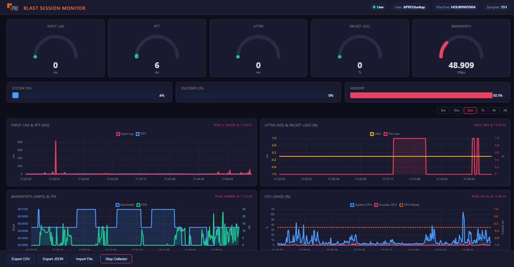
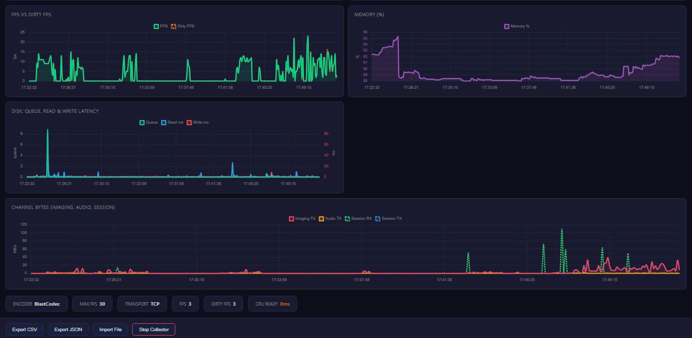

# "Blast Session Performance Monitor" Free, Zero-Dependency PowerShell Tool

**TL;DR:** A single PowerShell script that collects 18+ Horizon Blast performance metrics in real-time, stores 8 hours of history, and serves a live web dashboard — no installation, no agents, no ports opened. Double-click and go.

**Download:** [blast-monitor.ps1](link) | [GitHub](link)

---

## The Problem

Every VDI admin has been there: a user calls saying "my screen is slow." You check the Connection Server, everything looks fine. You check the ESXi host no contention. But the user insists something is wrong.

The truth is, **Blast session quality is measured at the endpoint**, not the server. RTT, jitter, packet loss, input lag, encoder performance — these metrics exist in Windows Performance Counters on every VDI desktop with Horizon Agent, but nobody collects them systematically.

Existing options are either too heavy (vROps + dashboards), require agents (ControlUp, Liquidware), or don't expose the right Blast-specific counters.

## The Solution

**Blast Session Performance Monitor** is a single `.ps1` file (~1200 lines) that:

- Runs on **any Windows VDI desktop** with Horizon Agent
- **Zero installation** copy, double-click, done
- Collects **18 metrics** every 5 seconds from Windows Performance Counters
- Serves a **real-time web dashboard** at `http://localhost:8888`
- Stores **8 hours** of data in memory (full workday)
- Exports to **CSV or JSON** for offline analysis
- Optionally writes to a **network share** for centralized monitoring
- **No firewall ports needed** uses TcpListener on localhost only
- Works with **Blast TCP and UDP** transport

## Collected Metrics

| Category | Metric | What It Tells You |
|---|---|---|
| **Network** | RTT (Round Trip Time) | Client-to-server latency (ms). The fundamental network quality indicator. |
| | Jitter | Variation in packet delivery time (ms). High values degrade video/audio. |
| | Packet Loss | Lost packet percentage. Above 1% directly impacts user experience. |
| | Estimated Bandwidth | Available bandwidth as detected by the Blast protocol (Kbps). |
| **Display/Encoder** | FPS | Frames processed per second. Direct measure of screen fluidity. |
| | Dirty FPS | Frames changed per second. Compare with FPS to identify encoder bottlenecks. |
| | Encoder Type | Active codec (BlastCodec, NVENC, H.264, etc.) and HW/SW acceleration. |
| | Encoder Max FPS | Policy-defined FPS cap. If FPS equals this value, policy is the bottleneck. |
| **User Experience** | Input Lag | Delay between user input and screen response (ms). The most critical UX metric. |
| **System** | System CPU | Total processor utilization (%). |
| | Encoder CPU | CPU consumption of the Blast encoder process (VMBlastW). |
| | CPU Ready (Stolen Time) | Time the VM was ready to run but waiting for physical CPU (ms). ESXi overcommit indicator. |
| | Memory | Physical memory utilization (%). |
| | Disk Queue Length | Pending disk I/O operations. High values indicate storage bottlenecks. |
| | Disk Read/Write Latency | Average duration of read/write operations (ms). |
| **Channel Traffic** | Imaging TX | Display channel bandwidth consumption (KB/s). |
| | Audio TX | Audio channel bandwidth consumption (KB/s). |
| | Session RX/TX | Total session traffic (KB/s), all channels combined. |

## Dashboard Screenshots

The dashboard is a single-page HTML app served from the script itself — no external dependencies.

### Overview: Gauges, Input Lag & RTT, Jitter & Packet Loss, Bandwidth & FPS, CPU Usage


### FPS vs Dirty FPS, Memory, Disk I/O, Channel Traffic & Session Info


## Quick Start

### Option 1: Standalone (User Self-Service)
```powershell
# Copy to VDI desktop and run
.\blast-monitor.ps1
# Open browser: http://localhost:8888
```

### Option 2: User + Admin (Centralized Monitoring)

**On the VDI endpoint** — edit `blast-monitor-user.cmd`:
```cmd
set OUTPUT_DIR=\\fileserver\vdi-perf\%COMPUTERNAME%
```
Double-click to start. Metrics are written to the share every 30 seconds.

**On the admin PC** — edit `blast-monitor-admin.cmd`:
```cmd
set WATCH_FILE=\\fileserver\vdi-perf\DESKTOP01\blast_live.json
```
Double-click to start. Dashboard shows live data from the remote endpoint.

**Zero ports opened.** Data exchange is entirely file-based via network share.

### Option 3: Import Historical Data
```powershell
.\blast-monitor.ps1 -ImportFile "session_2026-03-23.json"
# or
.\blast-monitor.ps1 -ImportFile "exported_data.csv"
```

## Troubleshooting Guide — What the Data Tells You

| Symptom | Metrics to Check | Root Cause |
|---|---|---|
| "Screen is frozen/slow" | High Input Lag + Low FPS | Encoder or network latency. Cross-check Encoder CPU and RTT. |
| Encoder bottleneck | High Dirty FPS but Low FPS | Screen is changing but encoder can't keep up. Check Encoder CPU and codec type. |
| Network issue | RTT >50ms, Jitter >10ms, PL >1% | Network infrastructure latency or loss. If bandwidth is also low, capacity issue. |
| Hypervisor pressure | High CPU Ready (Stolen Time) | VM is waiting for physical CPU. ESXi host overcommit indicator. |
| Memory pressure | Memory >90% + FPS drop | Insufficient RAM affects encoder cache and application performance. |
| Storage bottleneck | Disk Queue >2, Latency >20ms | Slow profile disk or App Volumes. Affects login and app launch times. |
| Bandwidth saturation | Low Est. BW + High Imaging TX | Network capacity can't handle encoder output. Consider codec change or QoS. |
| FPS capped by policy | FPS = Encoder Max FPS (constant) | FPS upper limit is policy-restricted. Increase if needed. |
| Video conferencing impact | Audio TX spike + Imaging TX drop | Audio channel consuming bandwidth. Check Teams/Zoom/Webex optimization. |

## Technical Details

- **Language:** PowerShell 5.1+ (built into every Windows)
- **Execution:** Self-bypasses execution policy, no admin required for basic mode
- **Dashboard:** Pure HTML/JS/CSS served via .NET TcpListener — no external web server
- **Data source:** `System.Diagnostics.PerformanceCounter` + WMI for VMware Tools counters
- **Memory:** ~50MB for 8 hours of 5-second samples
- **CPU impact:** <1% — counter reads are lightweight

## Why Not Just Use vROps?

| | vROps | This Tool |
|---|---|---|
| Setup time | Hours/days | Seconds |
| Infrastructure | vROps appliance + licenses | None |
| Endpoint metrics | Limited (server-side view) | Full (endpoint-side, 18+ counters) |
| Input Lag | Not available | Yes |
| Encoder CPU | Not available | Yes |
| Dirty FPS | Not available | Yes |
| Real-time | 5-min intervals | 5-second intervals |
| Cost | $$$$ | Free |

vROps is great for infrastructure-level monitoring. This tool fills the gap for **session-level, endpoint-side** troubleshooting that vROps can't see.

## Contributing

This tool is free and open source. Contributions, bug reports, and feature requests are welcome.

If you find it useful, please share it with your VDI admin community. Every admin deserves better Blast session visibility.

---

*Built by the APRO EUC Support Team. Tested on Horizon 8 (2406-2512) with Blast TCP and UDP transport.*
